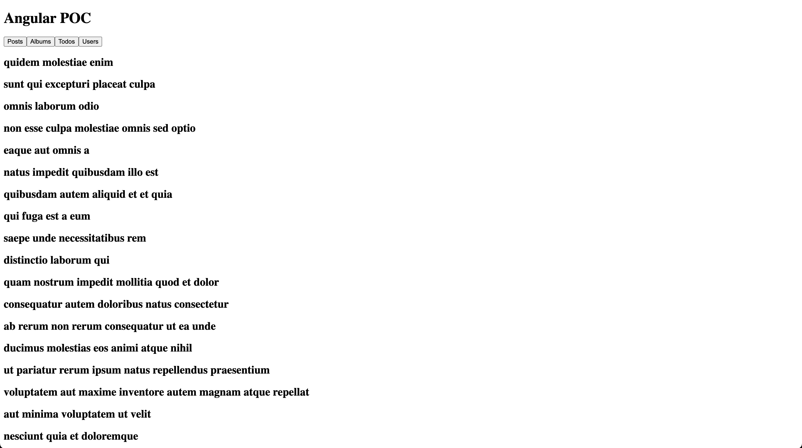

# Angular Proof of Concept (POC) by creating an application with the public API [JSONPlaceHolder](https://jsonplaceholder.typicode.com/)

This project is a Proof of Concept (POC) built using [Angular CLI](https://github.com/angular/angular-cli) version 18.2.12.

## Getting Started

### Prerequisites

Make sure you have [Node.js](https://nodejs.org/) and [Angular CLI](https://angular.io/cli) installed.

### Installation

1. Clone the repository:

2. Switch branch to 2-test-angular:
    ```sh
    git switch 2-test-angular
    ```
2. Navigate to the project directory:
    ```sh
    cd POC/angular-poc
    ```
3. Install the dependencies:
    ```sh
    npm install
    ```

## Development

### Running the Development Server

Run the following command to start the development server:
```sh
npm run start
```

## Using JsonPlaceholder in Angular

### Installation and Setup:

#### Step 1: Install provideHttpClient (if its not installed)
```sh
npm install -g @angular/cli
```

#### Step 2: Import provideHttpClient to your app.config.ts/app.module.ts
```sh
import { ApplicationConfig, provideZoneChangeDetection } from '@angular/core';
import { provideRouter } from '@angular/router';

import { routes } from './app.routes';
import { provideHttpClient, withFetch } from '@angular/common/http'; #import from @angular/common/http

export const appConfig: ApplicationConfig = {
  providers: [
    provideZoneChangeDetection({ eventCoalescing: true }),
    provideRouter(routes),
    provideHttpClient ( #Add it to your providers
        withFetch(), #Configures the current HttpClient instance to make requests using the fetch API
    )]
};
```
 ### Create a simple app:

 #### Step 1: Setup your service
 ```sh
 ng generate service services/jsonplaceholder  
 ```
 ```sh
 #inside your service.ts
 
 import { Injectable } from '@angular/core';
import { HttpClient } from '@angular/common/http';
import { Observable } from 'rxjs';

@Injectable({
  providedIn: 'root'
})
export class JsonPlaceholderService {
  private apiUrl = 'https://jsonplaceholder.typicode.com';

  constructor(private http: HttpClient) {}

  getPosts(): Observable<any> {
    return this.http.get(`${this.apiUrl}/posts`);
  }

  deletePost(id: number): Observable<any> {
    return this.http.delete(`${this.apiUrl}/posts/${id}`);
  }

  #Add all needed methodes
  
  #GET	/posts
  #GET	/posts
  #GET	/posts/1
  #GET	/posts/1/comments
  #GET	/comments?postId=1
  #POST	/posts
  #PUT	/posts/1
  #PATCH	/posts/1
  #DELETE	/posts/1
}
```

#### Step 2: Create components to print information from the request (exemple)
```sh
#In your component.ts

export class AlbumsComponent implements OnInit {
  albums: any[] = [];
  newAlbum: any = { title: '' };
  
  constructor(private jsonPlaceholderService: JsonPlaceholderService) {}

  ngOnInit(): void {
    this.jsonPlaceholderService.getAlbums().subscribe((data) => {
      this.albums = data;
    });
  }
}
```

```sh
#In your component.html

@for (album of albums; track album) {
    <h2>{{ album.title }}</h2>
}
```

 #### Step 3: Setup your app.componant.ts (main componant)

 ```sh
 import { Component } from '@angular/core';
import { PostsComponent } from './components/posts/posts.component';
import { AlbumsComponent } from './components/albums/albums.component';
import { TodosComponent } from './components/todos/todos.component';
import { UsersComponent } from './components/users/users.component';

@Component({
  selector: 'app-root',
  templateUrl: './app.component.html',
  styleUrls: ['./app.component.css'],
  imports: [PostsComponent, AlbumsComponent, TodosComponent, UsersComponent],
  standalone: true,
})
export class AppComponent {
  title = 'Angular POC';
  selectedComponent: any = null;

  components = [
    { name: 'Posts', component: PostsComponent },
    { name: 'Albums', component: AlbumsComponent },
    { name: 'Todos', component: TodosComponent },
    { name: 'Users', component: UsersComponent }
  ];

  loadComponent(component: any) {
    this.selectedComponent = component;
  }

  constructor() {}

}
```

#### Step 4: Add a simple html to your app.component.html
```sh
<div>
  <h1>{{ title }}</h1>
  @for (comp of components; track comp) {
    <button (click)="loadComponent(comp.component)">{{ comp.name }}</button>
  }
  @if (selectedComponent) {
    @switch (selectedComponent.name) {
      @case ('_PostsComponent') {
        <app-posts></app-posts>
      }
      @case ('_AlbumsComponent') {
        <app-albums></app-albums>
      }
      @case ('_TodosComponent') {
        <app-todos></app-todos>
      }
      @case ('_UsersComponent') {
        <app-users></app-users>
      }
    }
  }
</div>
```


##### When albums button is clicked:


