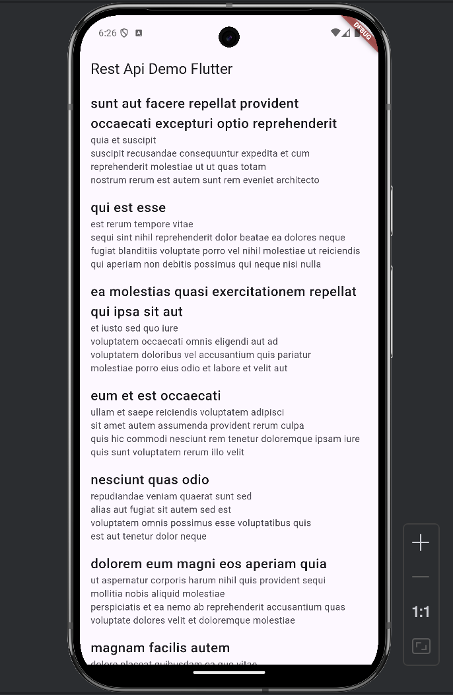

# apps

A new Flutter project (JsonPlaceHolder API).

## Getting Started

This project is a starting point for a Flutter application.

A few resources to get you started if this is your first Flutter project:

- [Lab: Write your first Flutter app](https://docs.flutter.dev/get-started/install)
- [Cookbook: Useful Flutter samples](https://docs.flutter.dev/cookbook)

For help getting started with Flutter development, view the
[online documentation](https://docs.flutter.dev/), which offers tutorials,
samples, guidance on mobile development, and a full API reference.

# Rest API Demo in Flutter

This Flutter application demonstrates how to fetch and display data from a REST API using `FutureBuilder`. It is a simple app that lists posts with their title and body.

---

## Features
- Fetches data from a REST API.
- Displays the data in a scrollable `ListView`.
- Shows a loading indicator while data is being retrieved.

---

## How to Use

### 1. Setup the Project
- Copy the provided code into your Flutter project.
- Ensure your project is connected to the internet (to fetch API data).

### 2. Define `getProductData()`
The app relies on a `Future<List<PostList>> getProductData()` function to fetch data. Implement this function to make an HTTP GET request to your desired API. Example:

```dart
import 'dart:convert';
import 'package:http/http.dart' as http;

Future<List<PostList>> getProductData() async {
  final response = await http.get(Uri.parse('https://jsonplaceholder.typicode.com/posts'));
  if (response.statusCode == 200) {
    final List<dynamic> jsonData = json.decode(response.body);
    return jsonData.map((json) => PostList.fromJson(json)).toList();
  } else {
    throw Exception('Failed to load data');
  }
}
````

## Code Overview
### 1. MyApp Class
The main entry point of the app that uses MaterialApp to set up the app's navigation and theme.

```dart
class MyApp extends StatelessWidget {
const MyApp({super.key});

@override
Widget build(BuildContext context) {
    return const MaterialApp(
    home: HomePage(),
    );
}
}
```

### 2. HomePage Class
This is the primary screen. It uses FutureBuilder to:
- Fetch data asynchronously.
- Display data in a ListView once the API call is complete.

```dart
class HomePage extends StatelessWidget {
  const HomePage({super.key});

  @override
  Widget build(BuildContext context) {
    return Scaffold(
      appBar: AppBar(
        title: const Text("Rest Api Demo Flutter"),
      ),
      body: FutureBuilder(
          future: getProductData(),
          builder: (context, AsyncSnapshot<List<PostList>> postSnapshot) {
            if (postSnapshot.hasData) {
              return ListView.builder(
                  itemCount: postSnapshot.data!.length,
                  itemBuilder: (context, index) {
                    return ListTile(
                      title: Text(postSnapshot.data![index].title,
                          style: const TextStyle(
                            fontWeight: FontWeight.w500,
                            fontSize: 20,
                          )),
                      subtitle: Text(postSnapshot.data![index].body),
                    );
                  });
            }
            return const Center(
              child: CircularProgressIndicator(),
            );
          }),
    );
  }
}
```
### 3. PostList Class
A model class that represents the structure of the data fetched from the API. It includes:

- Fields: userId, id, title, body.
- A fromJson factory constructor to map JSON data to Dart objects.
```dart
class PostList {
  int userId;
  int id;
  String title;
  String body;

  PostList(
      {required this.id,
        required this.userId,
        required this.title,
        required this.body});

  factory PostList.fromJson(dynamic json) => PostList(
      id: json["id"],
      userId: json["userId"],
      title: json["title"],
      body: json["body"]);
}
```
## Dependencies
Add the http package to your pubspec.yaml file:

```yaml
dependencies:
  flutter:
    sdk: flutter
  http: ^0.15.0
  ```
## Customization
Change the getProductData() function URL to point to your own REST API endpoint.
Modify the PostList model fields to match your API's JSON structure.

## Screenshots



